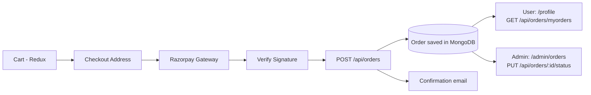

 <div align="center">


# MarketLane

**A full-stack MERN e-commerce platform with Razorpay payments, email verification, and a complete admin panel.**

[](https://marketlane-backend-yfbg.onrender.com)


[Live Demo](https://marketlane-backend-yfbg.onrender.com) · [Repository](https://github.com/CHANDU01410/MarketLane) · 

</div> 

---

## Table of Contents

- [Overview](#overview)
- [Features](#features)
- [Tech Stack](#tech-stack)
- [Project Structure](#project-structure)
- [How It Works](#how-it-works)
  - [Authentication Flow](#authentication-flow)
  - [Email Verification](#email-verification)
  - [Payment Flow](#payment-flow)
  - [Order Flow](#order-flow)
- [API Reference](#api-reference)
- [Getting Started](#getting-started)
- [Environment Variables](#environment-variables)
- [Deployment](#deployment)
- [Security](#security)
- [Future Enhancements](#future-enhancements)
- [Author](#author)

---

## Overview

MarketLane delivers a complete online shopping experience: product browsing, persistent cart state, Razorpay checkout, transactional email notifications, and an admin control panel for managing products, orders, users, and store metrics.

> **Note:** The live demo runs on Render's free tier and Razorpay **Test Mode**. The first request after a period of inactivity may take a few seconds to wake the server, and no real payments are processed.

---

## Features

### 🔐 Authentication & Authorization
- Registration with password hashing (`bcryptjs`).
- Email verification required before first login.
- JWT-based authentication with protected-route middleware.
- Role-based access control (`user` vs `admin`).
- Session persistence via `localStorage`.

### ✉️ Email Verification
- 32-byte cryptographically random hex token generated at signup.
- Token expires after 10 minutes.
- Verification link delivered via Nodemailer (Gmail SMTP).
- Resend endpoint for unverified accounts.
- Confirmation email sent after successful verification.

### 🛍️ Products & Catalog
- Browse with category filtering and keyword search (name, description, category).
- Product detail pages with stock, pricing, description, and imagery.
- Featured products on the homepage.
- Database seeder (`seedProducts.js`) with a preconfigured catalog.

### 🛒 Shopping Cart
- Redux Toolkit state management, persisted to `localStorage`.
- Add items, adjust quantities, remove items, or clear the cart.
- Live order summary (subtotal and total).

### 💳 Checkout & Payments
- Shipping address form (full name, street, city, postal code, country).
- Razorpay Test Mode integration: INR order creation and checkout modal.
- Server-side HMAC SHA256 signature verification.
- Development-only bypass mode when Razorpay credentials are not configured.

### 📦 Order Management
- Orders tied to verified customer accounts.
- Automatic order confirmation emails.
- Order history in the user profile with itemized breakdowns and delivery address.
- Admin-controlled fulfillment status updates.

### 🧰 Admin Panel
| Area | Capabilities |
|------|--------------|
| **Dashboard** | Total revenue, order count, user count, catalog size |
| **Products** | Add (with Cloudinary image upload), edit (including image replacement), delete |
| **Orders** | View all orders, filter by status, search by order ID or user name, update status |
| **Users** | Directory of accounts with roles, verification status, and join dates |

---

## Tech Stack

| Layer | Technologies |
|-------|--------------|
| **Frontend** | React 19, React Router DOM v7, Redux Toolkit, React Redux, Context API, modular vanilla CSS |
| **Backend** | Node.js, Express 5, JSON Web Tokens, bcryptjs, Multer, Nodemailer, Razorpay SDK, `cors`, `dotenv`, Node `crypto` |
| **Database** | MongoDB with Mongoose 9 |
| **Services** | Cloudinary (image CDN), Razorpay (payments, Test Mode), Gmail SMTP (emails) |
| **Hosting** | Render Web Service. Express serves both the REST API and the production React build |

---

## Project Structure

```
MarketLane/
├── package.json                    # Root scripts for multi-package workflows
│
├── backend/                        # Express API & server
│   ├── config/                     # cloudinary.js, db.js
│   ├── controllers/                # analytics, auth, order, payment, product logic
│   ├── middleware/                 # authMiddleware.js (JWT), adminMiddleware.js (role check)
│   ├── model/                      # order.js, product.js, user.js (Mongoose schemas)
│   ├── routes/                     # analytics, auth, order, payment, product routes
│   ├── utils/                      # sendEmail.js, verifyEmail.js
│   ├── .env.example                # Environment variable template
│   ├── index.js                    # App entrypoint, middleware, static build serving
│   └── seedProducts.js             # Catalog seeder
│
└── frontend/                       # React single-page application
    ├── public/                     # index.html (Razorpay script), brand assets
    └── src/
        ├── admin/                  # Dashboard, Products, Orders, Users, Add/Edit Product
        ├── components/             # Navbar, Footer, ProductCard
        ├── context/                # authContext.jsx (auth state + localStorage sync)
        ├── pages/                  # Home, Shop, ProductDetail, Cart, Checkout,
        │                           # OrderSuccess, Login, Register, Profile,
        │                           # About, ReturnPolicy, Disclaimer
        ├── redux/                  # cartSlice.js, store.js
        ├── styles/                 # global, navbar, product, cart, auth, admin CSS
        ├── App.jsx                 # Routes and layout
        └── index.js                # Root mount with Redux/Auth providers
```

---

## How It Works

### Authentication Flow

```
1. Register         POST /api/auth/register
   ├─ Validates email uniqueness
   ├─ Hashes password (bcryptjs, 10 salt rounds)
   ├─ Generates 32-byte hex token (expires in 10 minutes)
   ├─ Sends verification email via Nodemailer
   └─ Saves user with isVerified: false

2. Verify email    GET /api/auth/verify-email/:token
   ├─ Finds user by token where expiry > Date.now()
   ├─ Sets isVerified: true and clears token fields
   └─ Sends confirmation email

3. Log in          POST /api/auth/login
   ├─ Checks credentials with bcrypt.compare()
   ├─ Rejects unverified users (403)
   ├─ Signs JWT { id: user._id } (expires in 30 days)
   └─ Returns { _id, name, email, role, token }

4. Client session
   ├─ Stores credentials in localStorage under "userInfo"
   └─ Populates React AuthContext

5. Protected requests
   ├─ Client sends  Authorization: Bearer <token>
   ├─ "protect" middleware decodes the token and sets req.user
   └─ "admin" middleware verifies req.user.role === 'admin'
```

### Email Verification

1. **Token generation:** `utils/verifyEmail.js` creates a random 32-byte hex token with Node's `crypto` module.
2. **Expiration:** The expiry (`Date.now() + 10 * 60 * 1000`) is stored on the `User` document.
3. **Link construction:** `${BACKEND_URL}/api/auth/verify-email/${token}`. In production, `BACKEND_URL` is the Render domain.
4. **Verification:** `GET /api/auth/verify-email/:token` checks the token and expiry, sets `isVerified: true`, removes the token fields, and sends a confirmation email.
5. **Resend:** Unverified users can call `POST /api/auth/verify-email` with their email address to receive a fresh token and link.

### Payment Flow

MarketLane uses Razorpay in **Test Mode**:

1. **Start:** On `/checkout`, the user enters a shipping address and clicks **Pay Now**.
2. **Create order:** The frontend calls `POST /api/payment/order` with the cart total. The backend creates a Razorpay order (currency `INR`, amount converted to paise, receipt = random 10-byte hex string).
3. **Open modal:** The backend returns the Razorpay order ID, and the frontend launches the checkout modal (`new window.Razorpay(options)`) with the key ID, prefilled customer data, and order ID.
4. **Verify:** On success, Razorpay returns `razorpay_order_id`, `razorpay_payment_id`, and `razorpay_signature`. The frontend posts them to `POST /api/payment/verify`, where the backend computes an HMAC SHA256 digest with `RAZORPAY_KEY_SECRET` and compares it to the signature.
5. **Save order:** Once verified, the frontend calls `POST /api/orders` with the items, total, shipping address, and `paymentId`.
6. **Development bypass:** If Razorpay environment variables are not configured locally, the frontend offers an optional test bypass prompt so the order flow can be exercised without errors.

### Order Flow



**Order statuses:** `Pending` (default) → `Processing` → `Shipped` → `Delivered`, or `Cancelled`. Admins can change status at any time from the Admin Orders panel, and changes persist immediately.

---

## API Reference

### System

| Method | Endpoint | Auth | Admin | Description |
|--------|----------|:----:|:-----:|-------------|
| `GET` | `/api/health` | – | – | Health check for the backend server |

### Authentication · `/api/auth`

| Method | Endpoint | Auth | Admin | Description |
|--------|----------|:----:|:-----:|-------------|
| `POST` | `/api/auth/register` | – | – | Register an account and send a verification email |
| `POST` | `/api/auth/login` | – | – | Authenticate, check verification, return JWT |
| `POST` | `/api/auth/verify-email` | – | – | Resend the verification link |
| `GET` | `/api/auth/verify-email/:token` | – | – | Verify an email address |
| `GET` | `/api/auth/users` | ✅ | ✅ | List all users (password hashes excluded) |

### Products · `/api/products`

| Method | Endpoint | Auth | Admin | Description |
|--------|----------|:----:|:-----:|-------------|
| `GET` | `/api/products` | – | – | List all products |
| `GET` | `/api/products/:id` | – | – | Get a product by ObjectId |
| `POST` | `/api/products` | ✅ | ✅ | Upload image to Cloudinary and create a product |
| `PUT` | `/api/products/:id` | ✅ | ✅ | Update a product, optionally replacing its image |
| `DELETE` | `/api/products/:id` | ✅ | ✅ | Delete a product |

### Orders · `/api/orders`

| Method | Endpoint | Auth | Admin | Description |
|--------|----------|:----:|:-----:|-------------|
| `POST` | `/api/orders` | ✅ | – | Create an order and email a confirmation |
| `GET` | `/api/orders/myorders` | ✅ | – | Get the current user's orders |
| `GET` | `/api/orders` | ✅ | ✅ | Get all orders with populated user details |
| `PUT` | `/api/orders/:id/status` | ✅ | ✅ | Update an order's fulfillment status |

### Payments · `/api/payment`

| Method | Endpoint | Auth | Admin | Description |
|--------|----------|:----:|:-----:|-------------|
| `POST` | `/api/payment/order` | – | – | Create a Razorpay order for an INR amount |
| `POST` | `/api/payment/verify` | – | – | Verify a Razorpay signature (HMAC SHA256) |

### Analytics · `/api/analytics`

| Method | Endpoint | Auth | Admin | Description |
|--------|----------|:----:|:-----:|-------------|
| `GET` | `/api/analytics` | ✅ | ✅ | Total orders, products, users, and revenue |

---

## Getting Started

### Prerequisites

- [Node.js](https://nodejs.org/) v18 or higher
- npm
- MongoDB running locally, or a MongoDB Atlas connection string

### Installation

```bash
# 1. Clone the repository
git clone https://github.com/CHANDU01410/MarketLane.git
cd MarketLane

# 2. Install dependencies for root, backend, and frontend
npm run install-all

# 3. Create your environment file
cp backend/.env.example backend/.env
```

<details>
<summary>Prefer to install each package manually?</summary>

```bash
npm install
cd backend && npm install
cd ../frontend && npm install
cd ..
```

</details>

Edit `backend/.env` with your MongoDB URI, JWT secret, Gmail credentials, and API keys (see [Environment Variables](#environment-variables)).

### Seed the Catalog (optional)

```bash
cd backend
node seedProducts.js
cd ..
```

### Run in Development

```bash
npm run dev
```

| Service | URL |
|---------|-----|
| Frontend | http://localhost:3000 |
| Backend | http://localhost:5000 |

To run them separately:

```bash
npm run dev:server   # Terminal 1 – backend API
npm run dev:client   # Terminal 2 – frontend client
```

---

## Environment Variables

Create `backend/.env` from the template below:

```env
PORT=5000
NODE_ENV=development
MONGO_URI=mongodb://localhost:27017/marketlane-mern
JWT_SECRET=your_jwt_secret_key_here
BACKEND_URL=http://localhost:5000
FRONTEND_URL=http://localhost:3000

# Nodemailer / Gmail SMTP
EMAIL_USER=your_email@gmail.com
EMAIL_PASS=your_gmail_app_password

# Cloudinary
CLOUDINARY_CLOUD_NAME=your_cloudinary_cloud_name
CLOUDINARY_API_KEY=your_cloudinary_api_key
CLOUDINARY_CLOUD_SECRET=your_cloudinary_api_secret

# Razorpay (Test Mode)
RAZORPAY_KEY_ID=rzp_test_your_key_id
RAZORPAY_KEY_SECRET=your_razorpay_key_secret
```

> **Tip:** `EMAIL_PASS` must be a Gmail [App Password](https://support.google.com/accounts/answer/185833), not your regular account password.

---

## Deployment

MarketLane is deployed as a single **Render Web Service**:

| Setting | Value |
|---------|-------|
| Root Directory | `backend/` |
| Build Command | `npm install && cd ../frontend && npm install && npm run build` |
| Start Command | `node index.js` |

With `NODE_ENV=production`, Express statically serves `frontend/build` (`path.join(__dirname, "../frontend/build")`) and routes any non-API request to `frontend/build/index.html` for client-side routing.

**Environment variables to set in the Render dashboard:**

- `NODE_ENV=production`
- `MONGO_URI` (MongoDB Atlas connection string)
- `JWT_SECRET` (a long, random secret)
- `BACKEND_URL` and `FRONTEND_URL` (both `https://marketlane-backend-yfbg.onrender.com`)
- `EMAIL_USER`, `EMAIL_PASS`
- `CLOUDINARY_CLOUD_NAME`, `CLOUDINARY_API_KEY`, `CLOUDINARY_CLOUD_SECRET`
- `RAZORPAY_KEY_ID`, `RAZORPAY_KEY_SECRET`

> **Do not set `PORT` manually.** Render injects it at runtime, and `backend/index.js` listens on `process.env.PORT || 5000`.

---

## Security

- **Password hashing:** Passwords are never stored in plain text; `bcryptjs` with 10 salt rounds.
- **JWT authentication:** Stateless, signed tokens sent as Bearer headers.
- **Route protection:** The `protect` middleware validates the token and attaches the user without the password hash (`select('-password')`).
- **Role verification:** Product mutations, admin order updates, user listings, and analytics require `role === 'admin'`.
- **Email verification guard:** Unverified accounts cannot obtain a token.
- **Payment signature verification:** Razorpay responses are validated server-side with HMAC SHA256 before orders are saved.
- **Secret isolation:** API keys, database credentials, and token secrets live only in environment variables.

---

## Future Enhancements

- [ ] Customer wishlist
- [ ] Product reviews and star ratings
- [ ] Advanced filters (price range, brand, sort by price/rating)
- [ ] Discount coupon engine at checkout
- [ ] Server-side pagination for catalog, orders, and users
- [ ] Automated refund and return request workflow
- [ ] Light/dark theme toggle

---

## Author

**Chandu** · [@CHANDU01410](https://github.com/CHANDU01410)


